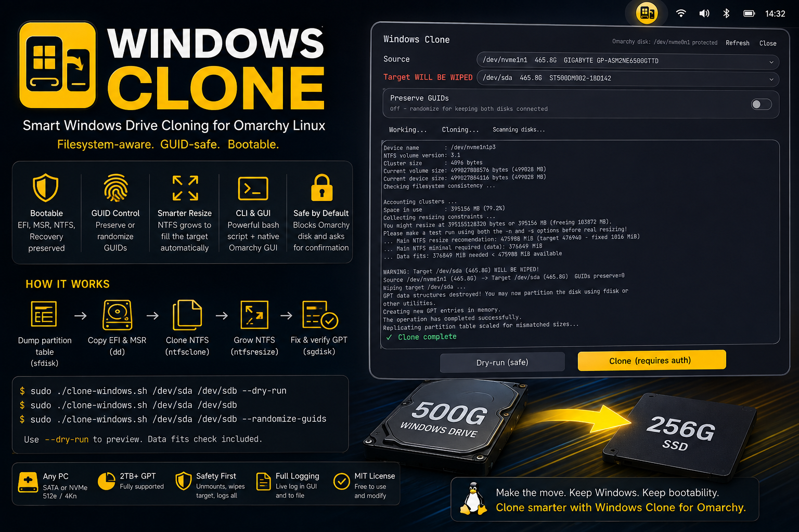

# Windows Clone



Clone a Windows installation to a smaller SSD when the **actual data fits**.

Unlike `dd`, Windows Clone understands the filesystem and can resize the main NTFS partition during the cloning process. This means a 500 GB Windows drive can be cloned to a 256 GB SSD if the Windows data uses less space than the target can hold.

It copies the complete Windows disk layout, including:

- EFI System Partition
- Microsoft Reserved (MSR) partition
- Windows NTFS partition
- Windows Recovery partition

The clone can then be installed in the client PC and booted as a replacement Windows drive.

> **Important:** The target disk will be completely erased. Double-check your source and target selections before starting a clone.

---

## Why Windows Clone?

A traditional `dd` clone copies sectors from one disk to another. This means the target normally needs to be at least as large as the source.

Windows Clone works differently:

1. Checks how much data is actually used.
2. Verifies that the data will fit on the target.
3. Recreates the GPT partition layout.
4. Resizes the Windows partition to fit the target.
5. Moves the Recovery partition when necessary.
6. Copies the EFI and MSR partitions.
7. Clones the Windows NTFS filesystem.
8. Grows the NTFS filesystem to use the available space.
9. Repairs and verifies the backup GPT.

This makes it possible to clone Windows from a larger drive to a smaller drive **without copying unused space**.

---

## Before You Start

### 1. Make sure your data fits

The target must have enough usable space for the data on the Windows partition.

Windows Clone checks this automatically using `ntfsresize --info`.

You will see either:

```text
Data fits
```

or:

```text
Data does NOT fit
```

If the data doesn't fit, use a larger target.

### 2. BitLocker must be disabled

BitLocker volumes must be decrypted before cloning.

From Windows, you can check BitLocker with:

```powershell
manage-bde -status
```

To decrypt the Windows drive:

```powershell
manage-bde -off C:
```

Wait for decryption to complete before starting the clone.

### 3. Back up anything important

The target disk is **wiped completely** during the cloning process.

Do not use a disk containing data you need.

---

# CLI Usage

The main cloning script is:

```text
clone-windows.sh
```

Run it with `sudo`.

### Preview a clone

It is recommended that you start with a dry run:

```bash
sudo ./clone-windows.sh /dev/source /dev/target --dry-run
```

A dry run shows what the script intends to do without modifying either disk.

### Clone a Windows drive

```bash
sudo ./clone-windows.sh /dev/sda /dev/sdb
```

The script will ask you to confirm the destructive operation by typing:

```text
YES
```

### Keep both drives connected

If the original and cloned Windows drives will remain connected to the same PC, use:

```bash
sudo ./clone-windows.sh /dev/sda /dev/sdb --randomize-guids
```

This gives the cloned disk new GPT and partition GUIDs.

If you are replacing the original Windows drive and the original will be removed, keeping the existing GUIDs is normally what you want.

---

## Command-Line Options

| Option | Description |
|---|---|
| `--dry-run` | Show the cloning plan without making changes. |
| `--randomize-guids` | Generate new disk and partition GUIDs for the clone. |
| `-h`, `--help` | Show the command-line help. |

---

# Omarchy GUI

Windows Clone includes a native **Quickshell plugin for Omarchy**.

After installation, a Windows Clone icon appears in the top-right bar:

```text
󰋊
```

Click the icon to open the cloning interface.

The GUI lets you:

- Select the Windows source disk.
- Select the target disk.
- Run a safe dry run.
- Start the clone.
- Preserve or randomize disk GUIDs.
- Monitor the live cloning log.
- See the final success or failure status.

### The Omarchy disk is protected

The plugin automatically detects the disk Omarchy is running from using:

```text
findmnt
lsblk
```

That disk is removed from the source and target selection lists.

**You cannot accidentally select the Omarchy system disk as the target.**

The detection works on systems where Omarchy is installed on any drive.

---

## Preserve GUIDs

The GUI provides a **Preserve GUIDs** toggle.

### On

The cloned disk keeps the original disk and partition GUIDs.

Use this when you are cloning a Windows drive and will **remove the original drive** before using the clone.

### Off

The cloned disk receives new GUIDs.

Use this when the original and cloned drives will remain connected to the same computer.

---

## Starting a Clone

1. Open Windows Clone from the Omarchy bar.
2. Select the Windows source disk.
3. Select the target disk.
4. Check the displayed disk sizes carefully.
5. Run **Dry-run** first if you're unsure.
6. Confirm that the data fits.
7. Click **Clone**.
8. Authenticate when Polkit asks for permission.
9. Monitor the live log.

The target disk will be wiped when the actual clone begins.

---

## Installation

From the marketplace (recommended):

```bash
omarchy plugin install com.compourri.windows-clone
```

Manual install:

```bash
mkdir -p ~/.config/omarchy/plugins/com.compourri.windows-clone
cp manifest.json Clone.qml BarWidget.qml ~/.config/omarchy/plugins/com.compourri.windows-clone/
cp clone-windows.sh ~/.local/bin/clone-windows.sh
chmod +x ~/.local/bin/clone-windows.sh
omarchy plugin enable com.compourri.windows-clone
```

The Windows Clone icon appears in the Omarchy bar. You click it. Or you launch:

```bash
omarchy-shell shell summon com.compourri.windows-clone '{}'
```

Press **Escape** or click outside the overlay to close it.

---

# Clone Status

The GUI displays the current operation and live log.

A successful clone ends with:

```text
✓ Clone complete
```

A failed clone displays:

```text
✗ Clone failed
```

The log view automatically moves to the latest output so errors are visible without manually scrolling.

Logs are stored at:

```text
~/.local/state/clone-windows.log
```

Commands executed through `pkexec` also write to:

```text
/root/.local/state/clone-windows.log
```

---

# How It Works

Windows Clone combines several Linux tools to perform the clone safely.

```text
Source Windows Disk
        │
        ▼
Check NTFS usage
        │
        ▼
Check target capacity
        │
        ▼
Read GPT partition table
        │
        ▼
Resize partition layout
        │
        ├──► Copy EFI
        │
        ├──► Copy MSR
        │
        ├──► Clone NTFS
        │
        └──► Move Recovery
        │
        ▼
Grow NTFS filesystem
        │
        ▼
Repair backup GPT
        │
        ▼
Verify GPT
        │
        ▼
Bootable Windows Clone
```

### NTFS cloning

A healthy NTFS filesystem is copied using:

```text
ntfsclone
```

The filesystem is then expanded using:

```text
ntfsresize
```

This allows the Windows partition to occupy the available space on the smaller target.

### Dirty NTFS

If the NTFS filesystem cannot be cloned normally, Windows Clone can fall back to:

```text
mkntfs
rsync -aHAX
```

This recreates the NTFS filesystem and copies the files while preserving important metadata.

---

# Requirements

Windows Clone is designed for **Omarchy/Arch Linux**.

Install the required packages:

```bash
sudo pacman -S gptfdisk ntfs-3g ntfsprogs dosfstools python rsync
```

The following utilities are required:

```text
sgdisk
sfdisk
partprobe
ntfsclone
ntfsresize
mkntfs
mkfs.vfat
blkid
lsblk
parted
blockdev
udevadm
python3
rsync
```

`rsync` is primarily required for the dirty-NTFS fallback.

---

# Disk Compatibility

Windows Clone supports:

- SATA drives
- NVMe drives
- SSDs
- HDDs
- GPT partition tables
- Targets larger than 2 TB
- Smaller targets, provided the Windows data fits

Logical sector sizes are checked automatically.

A `512-byte` logical sector size is required.

Physical `4096-byte` sectors are supported.

A logical sector-size mismatch, such as `512` vs `4096`, is detected before cloning.

---

# Safety Features

Windows Clone is designed to make destructive operations difficult to perform accidentally.

Before cloning, it:

- Detects the Omarchy system disk.
- Prevents the Omarchy disk from being selected as a target.
- Unmounts source and target partitions.
- Checks that the Windows data fits.
- Requires explicit `YES` confirmation from the CLI.
- Requires authentication before a GUI clone starts.
- Wipes the target before creating the new partition table.
- Logs the cloning process.
- Repairs the backup GPT.
- Verifies the resulting GPT.

The target is still intentionally destructive.

**Always verify the source and target disks before starting.**

---

# Project Layout

```text
manifest.json          # plugin manifest (repository root, required by marketplace)
Clone.qml              # overlay: pickers, Toggle, log
BarWidget.qml          # bar icon 󰋊
clone-windows.sh       # CLI cloner, bash set -euo pipefail
README.md
preview.png
```

Repository root is the plugin. `manifest.json` must stay at the root.

`manifest.json` defines the overlay and bar-widget entry points. `Clone.qml` provides the cloning interface. `BarWidget.qml` adds the icon.

---

# Using the CLI After Installation

If the script has been copied to your local binary directory:

```bash
sudo ~/.local/bin/clone-windows.sh /dev/sda /dev/sdb
```

From the project directory:

```bash
sudo ./clone-windows.sh /dev/sda /dev/sdb
```

The GUI is recommended for most users. The CLI is useful when you want direct control over the cloning process.

---

# Typical Example

Imagine you have:

```text
500 GB HDD
└── Windows
    └── 180 GB used

256 GB SSD
└── Empty
```

The Windows data is only 180 GB, so it fits on the 256 GB SSD.

Windows Clone can:

```text
500 GB Windows HDD
        │
        │  filesystem-aware clone
        ▼
256 GB SSD
        │
        ├── EFI
        ├── MSR
        ├── Windows NTFS
        └── Recovery
```

You don't need to copy the unused space on the 500 GB drive.

---

# License

Windows Clone is released under the **MIT License**.
